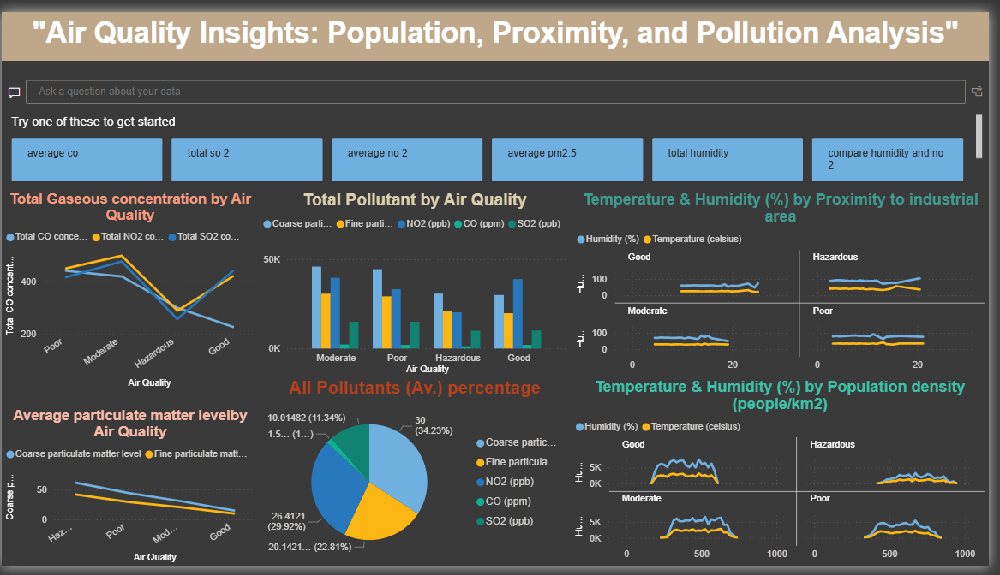

# air_quality_index
This is the repo containing data visualisation of air quality index.
# 🚀 Project Title: Air Quality Insights: Population, Proximity, and Pollution Analysis

An interactive Power BI dashboard analyzing air pollution patterns and their relationship with population density, industrial proximity, and environmental conditions.

## 📌 Overview

This repository contains an end-to-end Power BI data analytics project focused on understanding air quality dynamics using multiple environmental and demographic factors.

The project demonstrates:

Data cleaning and transformation

Exploratory data analysis

Interactive dashboard design

Insight-driven visual storytelling

It is designed to showcase industry-standard data analytics practices for recruiters, analysts, and decision-makers.

---

## 📂 Repository Structure

```
air-quality-powerbi/
│
├── dashboard/
│   └── air_quality.pbix           # Power BI dashboard file
│
├── data/
│   └── updated_pollution_data.csv # Cleaned dataset used in Power BI
│
├── screenshots/
│   └── dashboard_overview.png     # Dashboard preview image
│
├── README.md
└── LICENSE

```

---

## ⚙️ Tech Stack

Tool: Power BI Desktop

Languages: DAX, Power Query (M)

Data Format: CSV

Techniques:

Data modeling

Calculated measures

Interactive filtering & drill-downs

Visual analytics
---

## 📊 Workflow

Data Preparation

Cleaning and transforming pollution and environmental data

Creating calculated columns and measures using DAX

Analysis

Pollutant concentration analysis (CO, NO₂, SO₂, PM2.5)

Air quality categorization (Good, Moderate, Poor, Hazardous)

Comparison across population density and industrial proximity

Visualization

Line charts, bar charts, pie charts, and small multiples

Comparative and trend-based visual storytelling

Insight Generation

Identifying relationships between pollution, population, and climate factors

---

## 📈 Key Insights

Higher concentrations of CO, NO₂, SO₂, and PM2.5 are strongly associated with poor and hazardous air quality

Areas closer to industrial zones show elevated pollution levels

Population density correlates with increased pollutant concentration

Temperature and humidity patterns vary across air quality categories

📌 Interactive insights are available directly within the Power BI dashboard.

---

## ▶️ How to Use

Clone this repository:

```bash
git clone https://github.com/BatoolJohn/air-quality-powerbi.git

```
Open the dashboard:

Launch Power BI Desktop

Open dashboard/air_quality.pbix

(Optional) Replace or refresh the dataset if needed:

Ensure updated_pollution_data.csv path is correct

Click Refresh

---

## 📊 Dashboard Preview

<p align="center">
  
</p>

<p align="center">
  
</p>

---

## 🚧 Future Improvements

Add geographical maps for spatial pollution analysis

Integrate time-series analysis and forecasting

Connect to real-time air quality APIs

Add an executive summary page for stakeholders

---
## 📂 Dataset

This project uses a **synthetic air quality dataset** inspired by publicly available air pollution data from Kaggle.

Base features (pollutant concentrations, temperature, humidity) are derived from common Kaggle air quality datasets, while additional features such as:

- Population density  
- Proximity to industrial areas  
- Normalized pollutant values  
- Air quality categories  

were **engineered and simulated** for analytical and visualization purposes.
📎 Inspiration Dataset:
Kaggle – Air Quality Data in India  
https://www.kaggle.com/datasets/rohanrao/air-quality-data-in-india

## 📜 License

Distributed under the **MIT License**. See `LICENSE` for details.

---

## 📬 Contact

👤 **Attiya Batool**

* LinkedIn: [linkedin.com/in/attiya-b-996b832b](#)
* Email: [batooljohn@gmail.com](mailto:batooljohn@gmail.com)

---
